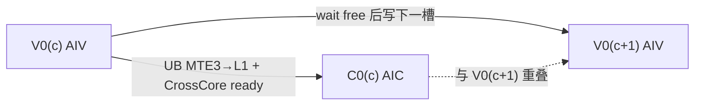
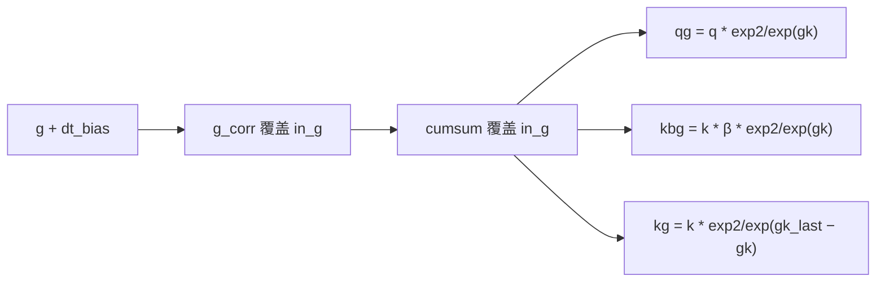
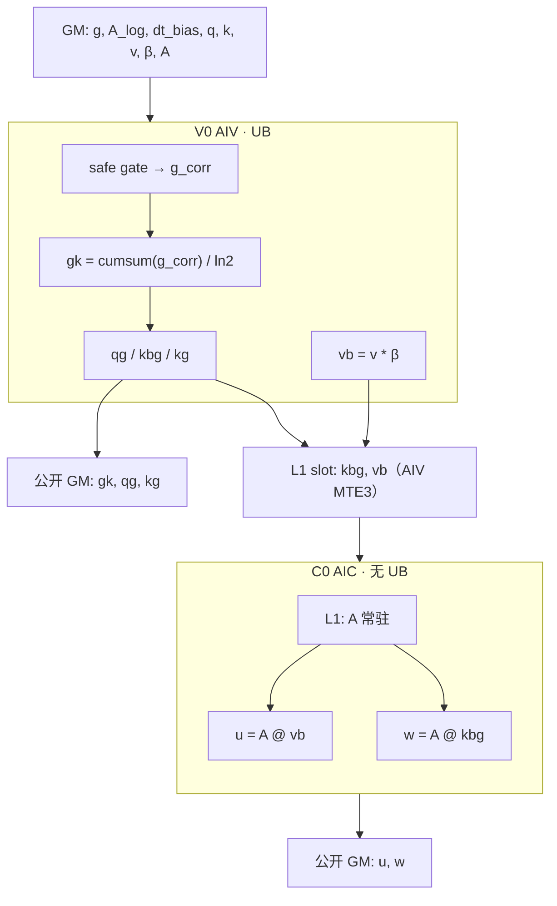

# KDA `kda_gate_chunk_cumsum` + `recompute_w_u_fwd` 融合设计

本文是融合 L0 的实现前设计，不是已发布 ABI。公开接口仍是 `aclnnKdaGateCumsum` 与 `aclnnRecomputeWUFwd`；本融合是新的私有 L0 `ChunkKdaBwdRecompute`，落地前需 `@weinachuan` 确认。仓内 GDN 的 `RecomputeWUFwd` 是 scalar-`g` 语义，不能直接拼。

L0 def / L2 aclnn / Torch 草案见 [INTERFACES.md](INTERFACES.md)。

目标平台 **Ascend 950（A5 / `ascend950`）**，片上容量按仓内 arch35 `HardwareInfo`（与 `GetCoreMemSize` 一致）：

| 资源 | A5 |
| --- | ---: |
| UB | 248 KiB |
| L1 | 512 KiB |
| L0A / L0B | 64 KiB |
| L0C | 256 KiB |

下文字节数按优势域 `BT = chunk = 64`、`K = V = 128`、`q/k/v/A/qg/kbg/kg/vb/w/u` 为 BF16，`g/gk/A_log/dt_bias` 与 gate 计算为 FP32，`beta` 峰值按 FP32。**所有 UB / L1 / L0 缓冲深度均为 2**（MTE/MMAD ping-pong）。UB 预留 16 KiB 给 TPipe，可用约 **232 KiB**。

公式：`bytes = 元素个数 × sizeof(dtype) × 深度`。BF16=2 B，FP32=4 B。一块 `[64,64]` BF16 深度 2 = 16 KiB；一块 `[64,64]` FP32 深度 2 = 32 KiB。

## 1. 数学与公开契约

每个 `(B, H_v, chunk)`。`use_exp2=true`（默认）走 `exp2`；`false` 走 `exp`。safe gate 里的 `exp(A_log)` 不受 `use_exp2` 影响。

```text
g_corr = lower_bound * sigmoid(exp(A_log) * (g + dt_bias))   # safe gate

use_exp2=true:
    gk  = chunk_cumsum(g_corr) / ln2
    qg  = q * exp2(gk)
    kbg = k * β * exp2(gk)
    kg  = k * exp2(gk_last - gk)

use_exp2=false:
    gk  = chunk_cumsum(g_corr)
    qg  = q * exp(gk)
    kbg = k * β * exp(gk)
    kg  = k * exp(gk_last - gk)

vb = v * β
u  = A @ vb
w  = A @ kbg
```

`activate_gate`（本融合对 `g` 的修正固定走 **safe gate**）：

```text
g_corr = lower_bound * sigmoid(exp(A_log) * (g + dt_bias))
```

默认 `lower_bound = -5`。`use_gate_in_kernel=false` 时 `g_corr = g`，cumsum 仍做。不走 `-exp(A_log)*softplus(...)`。

公开输出：`gk, qg, kg, w, u`（GM）。  
V0→C0 的 `kbg, vb`：AIV UB 经 **MTE3 直写 AIC L1**，不进 GM。  
`g_corr` 只活在 V0 的 UB，不进 GM / L1。

GQA：`q/k` 按 `H_k` 读，写 `qg/kbg/kg` 时按 `H_v / H_k` 映射。`A/v/β/g` 走 `H_v`。

## 2. Stage 划分

同一 stage 不能混 AIC/AIV。向量可以吃本 stage 的向量结果，所以 **修正** `g`**、cumsum、qg/kbg/vb/kg 全部在 V0**。Cube 不能吃本 stage 的 cube/vector 产出，所以 `A @ ·` 单独 C0。


| Stage  | 核   | 做什么                                                                  |
| ------ | --- | -------------------------------------------------------------------- |
| **V0** | AIV | safe gate 修正 `g` → `g_corr`；`gk = cumsum(g_corr)/ln2`；`qg/kbg/vb/kg` |
| **C0** | AIC | `u = A @ vb`，`w = A @ kbg`；`A` 驻 L1                                  |


跨 chunk 允许物理错拍 `C0(i) ∥ V0(i+1)`，不增加逻辑 stage。950 上 AIV 用 **MTE3 把 `kbg/vb` 从 UB 直接写进 AIC L1**，ready/free 用 **CrossCore flag**，不要走 GM 槽位，也不要靠全局 sync。




时间轴（3 个 chunk）：


## 3. Tile


| 符号   | 值   | 理由                                   |
| ---- | --- | ------------------------------------ |
| `BT` | 64  | chunk 一次进 UB/L1                      |
| `BK` | 64  | 超过 64×64 的矩阵乘只允许出现在 C0；V0 按 K 维 64 切 |
| `BV` | 64  | 同理，V 维 64 切                          |
| K 循环 | 2   | `K=128`                              |
| V 循环 | 2   | `V=128`                              |


一个 AIV task = `(batch, H_v, chunk)`。AIC 同一个 task 消费该 chunk 的 `kbg/vb`。

## 4. V0 UB

V0 分两段向量循环，**顺序执行、复用同一块 UB**，不是两个逻辑 stage。深度一律 2。`g` 为 FP32，没有单独的 `work`：`g_corr` / `gk` 原地覆盖 `in_g`。`tmp` 只做 sigmoid / `exp2`（或 `exp`）。`qg` / `kbg` / `kg` 各开一份输出，不再复用同一块 `out`。

### 4.1 K 循环：gate → cumsum → qg/kbg/kg

一次处理 `[BT, BK] = [64, 64]`。

| Slot | 形状 | dtype | 深度 | 算法 | 字节 | 生命周期 |
| --- | --- | --- | ---: | --- | ---: | --- |
| `in_g` | `[BT,BK]` | FP32 | 2 | 64×64×4×2 | 32 KiB | MTE2 搬 `g`，原地 `g_corr`→`gk`，再 MTE3 写公开 `gk` |
| `tmp` | `[BT,BK]` | FP32 | 2 | 64×64×4×2 | 32 KiB | sigmoid / `exp2`/`exp` |
| `dt_bias` | `[BK]` | FP32 | 2 | 64×4×2 | 512 B | 本 K tile |
| `a_log` | scalar | FP32 | 2 | 对齐 32 B ×2 | 64 B | 本 head |
| `beta` | `[BT]` | FP32 | 2 | 64×4×2 | 512 B | chunk 常驻；若输入 BF16 仍按 FP32 槽计 |
| `in_q` | `[BT,BK]` | BF16 | 2 | 64×64×2×2 | 16 KiB | GQA 按 `H_k` 读 |
| `in_k` | `[BT,BK]` | BF16 | 2 | 64×64×2×2 | 16 KiB | 同上 |
| `out_qg` | `[BT,BK]` | BF16 | 2 | 64×64×2×2 | 16 KiB | 写 `qg` |
| `out_kbg` | `[BT,BK]` | BF16 | 2 | 64×64×2×2 | 16 KiB | MTE3 写 L1 `kbg` |
| `out_kg` | `[BT,BK]` | BF16 | 2 | 64×64×2×2 | 16 KiB | 写 `kg` |
| `gk_last` | `[BK]` | FP32 | 2 | 64×4×2 | 512 B | 本 tile 最后一行，供 `kg` |

峰值 **32×2 + 16×5 + (512+64+512+512) B = 144 KiB + 1600 B ≈ 145.6 KiB**，低于可用 232 KiB。

行内顺序（`in_g` 原地）：



1. `g` 以 FP32 进 `in_g`，加 `dt_bias`，safe gate → **`g_corr` 覆盖 `in_g`**
2. 沿 `BT` 前缀和；`use_exp2=true` 时再 × `1/ln2` → **`gk` 覆盖 `in_g`**，末行拷到 `gk_last`；`gk` 从 `in_g` MTE3 到公开 GM
3. `exp2(gk)` 或 `exp(gk)` 进 `tmp`；`qg` 经 `out_qg` 写公开 GM；`kbg` 经 `out_kbg` **MTE3 写 L1**
4. `kg = k * exp2/exp(gk_last - gk)`，复用 `tmp`，经 `out_kg` 写公开 GM

`gk` 以 FP32 写公开 GM。`qg/kg` 以 BF16 写公开 GM。`kbg` 以 BF16 经 MTE3 进 L1。

### 4.2 V 循环：`vb = v * β`

与 K 循环无关，复用 UB，深度同样为 2。

| Slot | 形状 | dtype | 深度 | 算法 | 字节 |
| --- | --- | --- | ---: | --- | ---: |
| `in_v` | `[BT,BV]` | BF16 | 2 | 64×64×2×2 | 16 KiB |
| `work_v` | `[BT,BV]` | FP32 | 2 | 64×64×4×2 | 32 KiB |
| `out_vb` | `[BT,BV]` | BF16 | 2 | 64×64×2×2 | 16 KiB |
| `beta` | `[BT]` | FP32 | 2 | 64×4×2 | 512 B |

峰值 **64 KiB + 512 B ≈ 64.5 KiB**。`vb` 以 BF16 经 MTE3 直写 L1。C0 从这份 L1 槽做 MMAD，不在 UB 里把 FP32 `vb` 直接交给 cube。

## 5. C0 L1 / L0（无 UB）

AIC 不用 UB。`A` 从 GM 经 AIC MTE2 进 L1，`[BT, BT] = 64×64`，深度 2 驻留，`u` 和 `w` 共用。`vb` / `kbg` 已由 AIV **MTE3 写在 L1 槽里**，AIC 从该槽 MTE1 到 L0B，与 `A` 做 matmul（N 维 64 tile；`V=K=128` 时各两拍）。

| 缓冲 | 内容 | dtype | 深度 | 算法 | 字节 |
| --- | --- | --- | ---: | --- | ---: |
| L1 `A` | `[64,64]` NZ，AIC MTE2 自 GM | BF16 | 2 | 64×64×2×2 | 16 KiB |
| L1 `kbg` 双槽 | `[BT,K]`，AIV MTE3 自 UB | BF16 | 2 | 64×128×2×2 | 32 KiB |
| L1 `vb` 双槽 | `[BT,V]`，AIV MTE3 自 UB | BF16 | 2 | 64×128×2×2 | 32 KiB |
| L0A | `A` 的 64×64 | BF16 | 2 | 64×64×2×2 | 16 KiB |
| L0B | 当前 `B` tile（从 L1 `kbg`/`vb` 切 `[64,64]`） | BF16 | 2 | 64×64×2×2 | 16 KiB |
| L0C | `[64,64]` 累加 | FP32 | 2 | 64×64×4×2 | 32 KiB |

L1 峰值 **16 + 32 + 32 = 80 KiB**（≪ 512）。L0A/L0B 各 16 KiB（≪ 64），L0C 32 KiB（≪ 256）。Cube 不能依赖本 stage 的 cube 输出，两趟 GEMM 都读 V0 已经 MTE3 写好的 L1 槽。

Fixpipe 把 L0C 写成 `u/w` 的公开 GM，BF16。

## 6. AIC/AIV 核间：UB MTE3 → L1

950 上 AIV 的 Unified Buffer 经 **MTE3 直达 AIC L1**。`kbg/vb` 是 V0 产、C0 消的中间量，性能路径 **不进 GM**。ready/free 用 CrossCore flag（标量侧），不要把 payload 放进 SSBUF。

这不改变逻辑 stage：V0 仍是 AIV，C0 仍是 AIC，不能在同一逻辑 stage 混核。L1 双槽替代原来的 GM / SSBUF 数据槽。

### 6.1 槽位（推荐，支持 `C0(i) ∥ V0(i+1)`）

每个 Mix 核的 L1 上 2 slot，只放当前 / 下一 chunk 的整块 tile：

```text
slot = chunk_id % 2
kbg_slot[slot] : [BT, K]   # BF16，AIV MTE3 写、AIC MTE1 读
vb_slot [slot] : [BT, V]   # BF16
```

一份 `kbg` = `BT × K × 2` = 64×128×2 = **16 KiB**。双槽再 ×2。

| 项 | 公式 | 单核 L1 |
| --- | --- | ---: |
| `kbg` 双槽 | `2 × BT × K × 2` | 32 KiB |
| `vb` 双槽 | `2 × BT × V × 2` | 32 KiB |
| `A` 驻留 | `64×64×2×2` | 16 KiB |
| **合计** | | **80 KiB** |

协议：

- V0：UB 算完 `kbg/vb` → MTE3 写 L1 `slot` → `CrossCoreSetFlag` ready
- C0：`CrossCoreWaitFlag` ready → L1 槽 → L0B → MMAD；用完 `set free`
- V0 下一 chunk 写前 `wait free`
- tail / 空 chunk：AIV 也要走 set/wait，不能让 AIC 空等

`g_corr` 不进 L1。`gk/qg/kg/w/u` 是公开 GM 输出。

### 6.2 整段 GM workspace（仅调试）

与 golden 一致，调试简单，不能做 chunk 错拍，也用不上 UB→L1 MTE3：

```text
kbg : [B, H_v, T, K]  BNSD，BF16
vb  : [B, H_v, T, V]  BNSD，BF16
```

默认 golden `B=1,T=256,H_v=4,K=V=128`：各 256 KiB，合计 **512 KiB**。  
`T` 或 `H_v` 变大时按 `B×H_v×T×K×2` 线性涨（例如 `B=2,H_v=32,T=11264` 单份 `kbg` 约 176 MiB）。性能路径必须用 6.1，与 `T` 无关，**user workspace 可以为 0**。

系统 workspace 仍按 CANN `sysWorkspaceSize` 另加。

## 6.3 峰值汇总（A5）

| 位置 | 容量 | 本设计峰值 | 余量 |
| --- | ---: | ---: | ---: |
| UB（K 循环） | 248 KiB（可用 ~232） | **145.6 KiB** | ~86 KiB |
| UB（V 循环，复用） | 同上 | 64.5 KiB | 更松 |
| L1 | 512 KiB | **80 KiB**（`A` + `kbg/vb` 双槽） | 充足 |
| L0A | 64 KiB | 16 KiB | 充足 |
| L0B | 64 KiB | 16 KiB | 充足 |
| L0C | 256 KiB | 32 KiB | 充足 |
| user workspace | GM | **0**（性能路径） | 调试才走 6.2 |

K 循环是 UB 瓶颈。三份 `out_*` 同时在、且 `in_g`/`tmp` 都是 FP32 深度 2，所以比「单 `out` + 深度 1」的旧数高；仍进得去 232 KiB。

## 7. 数据流




V0 先跑完本 chunk 的向量，用 MTE3 把 `kbg/vb` 写进 L1 再交给 C0。C0 内部先 `u` 后 `w`，都从 L1 槽切 `[64,64]` 进 L0B，不读本 stage 刚写的 `u/w`。

## 8. 与已有算子的关系

- `KdaGateCumsum`：独立 L2 保留。本融合把 gate 修正 + cumsum 收进 V0，不再二次 launch。
- GDN `RecomputeWUFwd`：scalar `g`、`exp(g)`、不产 `qg/kg`，workspace 按 `2*B*H_v*T*V` 估。KDA 性能路径用 L1 槽位（AIV MTE3），不要按整段 `T` 申请 GM。
- `ChunkKdaFwd` 的 Prepare/Post-WU 是前向路径；本融合服务 **反向重计算**，不要塞进 `ChunkKdaFwd` 的公开原型。

