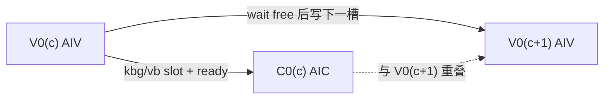
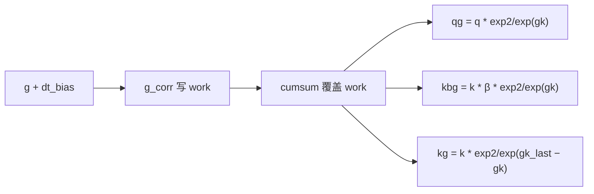
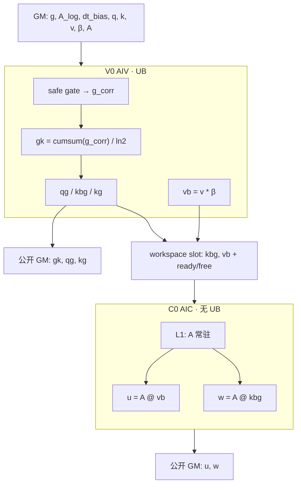

# KDA `kda_gate_chunk_cumsum` + `recompute_w_u_fwd` 融合设计

本文是融合 L0 的实现前设计，不是已发布 ABI。公开接口仍是 `aclnnKdaGateCumsum` 与 `aclnnRecomputeWUFwd`；本融合是新的私有 L0 `ChunkKdaBwdRecompute`，落地前需 `@weinachuan` 确认。仓内 GDN 的 `RecomputeWUFwd` 是 scalar-`g` 语义，不能直接拼。

L0 def / L2 aclnn / Torch 草案见 [INTERFACES.md](INTERFACES.md)。

目标平台按 `common/include/kernel/hardware.h`：


| 资源        | A2/A3   |
| --------- | ------- |
| UB        | 192 KiB |
| L1        | 512 KiB |
| L0A / L0B | 64 KiB  |
| L0C       | 128 KiB |


下文字节数按优势域 `BT = chunk = 64`、`K = V = 128`、输入 BF16、gate 计算 FP32。UB 预留 16 KiB 给 TPipe，可用约 176 KiB。

## 1. 数学与公开契约

每个 `(B, H_v, chunk)`。`use_exp2=true`（默认）走 `exp2`；`false` 走 `exp`。safe gate 里的 `exp(A_log)` 不受 `use_exp2` 影响。

```text
g_corr = lower_bound * sigmoid(exp(A_log) * (g + dt_bias))   # safe gate

use_exp2=true:
    gk  = chunk_cumsum(g_corr) / ln2
    qg  = q * exp2(gk)
    kbg = k * β * exp2(gk)
    kg  = k * exp2(gk_last - gk)

use_exp2=false:
    gk  = chunk_cumsum(g_corr)
    qg  = q * exp(gk)
    kbg = k * β * exp(gk)
    kg  = k * exp(gk_last - gk)

vb = v * β
u  = A @ vb
w  = A @ kbg
```

`activate_gate`（本融合对 `g` 的修正固定走 **safe gate**）：

```text
g_corr = lower_bound * sigmoid(exp(A_log) * (g + dt_bias))
```

默认 `lower_bound = -5`。`use_gate_in_kernel=false` 时 `g_corr = g`，cumsum 仍做。不走 `-exp(A_log)*softplus(...)`。

公开输出：`gk, qg, kg, w, u`。  
内部 workspace：`kbg, vb`。  
`g_corr` 只活在 V0 的 UB，不进 GM。

GQA：`q/k` 按 `H_k` 读，写 `qg/kbg/kg` 时按 `H_v / H_k` 映射。`A/v/β/g` 走 `H_v`。

## 2. Stage 划分

同一 stage 不能混 AIC/AIV。向量可以吃本 stage 的向量结果，所以 **修正** `g`**、cumsum、qg/kbg/vb/kg 全部在 V0**。Cube 不能吃本 stage 的 cube/vector 产出，所以 `A @ ·` 单独 C0。


| Stage  | 核   | 做什么                                                                  |
| ------ | --- | -------------------------------------------------------------------- |
| **V0** | AIV | safe gate 修正 `g` → `g_corr`；`gk = cumsum(g_corr)/ln2`；`qg/kbg/vb/kg` |
| **C0** | AIC | `u = A @ vb`，`w = A @ kbg`；`A` 驻 L1                                  |


跨 chunk 允许物理错拍 `C0(i) ∥ V0(i+1)`，不增加逻辑 stage。用 workspace slot + ready/free flag，不要靠全局 sync。




时间轴（3 个 chunk）：

```mermaid
gantt
  title 物理错拍 C0(i) ∥ V0(i+1)
  dateFormat X
  axisFormat %s
  section AIV
  V0 c0           :a1, 0, 3
  V0 c1           :a2, 3, 3
  V0 c2           :a3, 6, 3
  section AIC
  C0 c0           :c1, 3, 3
  C0 c1           :c2, 6, 3
  C0 c2           :c3, 9, 3
```




## 3. Tile


| 符号   | 值   | 理由                                   |
| ---- | --- | ------------------------------------ |
| `BT` | 64  | chunk 一次进 UB/L1                      |
| `BK` | 64  | 超过 64×64 的矩阵乘只允许出现在 C0；V0 按 K 维 64 切 |
| `BV` | 64  | 同理，V 维 64 切                          |
| K 循环 | 2   | `K=128`                              |
| V 循环 | 2   | `V=128`                              |


一个 AIV task = `(batch, H_v, chunk)`。AIC 同一个 task 消费该 chunk 的 `kbg/vb`。

## 4. V0 UB

V0 分两段向量循环，**顺序执行、复用同一块 UB**，不是两个逻辑 stage。

### 4.1 K 循环：gate → cumsum → qg/kbg/kg

一次处理 `[BT, BK] = [64, 64]`。`g_corr` 在 `work` 里算完后原地 cumsum 成 `gk`，不另开 GM。


| Slot      | 形状        | dtype | 深度  | 字节     | 生命周期                |
| --------- | --------- | ----- | --- | ------ | ------------------- |
| `in_g`    | `[BT,BK]` | BF16/FP32  | 2   | 16 KiB | MTE2 ping-pong      |
| `tmp`     | `[BT,BK]` | FP32  | 2   | 16 KiB | sigmoid / `exp2`    |
| `dt_bias` | `[BK]`    | FP32/BF16 | 2   | 256 B  | 本 K tile 常驻         |
| `a_log`   | scalar    | FP32/BF16  | 2   | 32 B   | 对齐到 32 B            |
| `beta`    | `[BT]`    | FP32/BF16  | 2   | 256 B  | chunk 常驻，K 循环外搬一次   |
| `in_q`    | `[BT,BK]` | BF16  | 2   | 16 KiB | GQA 按 `H_k` 读       |
| `in_k`    | `[BT,BK]` | BF16  | 2   | 16 KiB | 同上                  |
| `out_qg`     | `[BT,BK]` | BF16  | 2   | 16 KiB | 依次写 `qg`、`kbg`、`kg` |
| `out_kbg`     | `[BT,BK]` | BF16  | 2   | 16 KiB | 依次写 `qg`、`kbg`、`kg` |
| `out_kg`     | `[BT,BK]` | BF16  | 2   | 16 KiB | 依次写 `qg`、`kbg`、`kg` |
| `gk_last` | `[BK]`    | FP32  | 2   | 256 B  | 本 tile 最后一行，供 `kg`  |


峰值 **80.5 KiB**，低于 176 KiB。

行内顺序（同一 `work`）：



1. `g` → FP32，加 `dt_bias`，safe gate `lower_bound * sigmoid(exp(A_log)*x)` → `g_corr` **写在** `work`
2. 沿 `BT` 前缀和；`use_exp2=true` 时再 × `1/ln2` → `gk` **覆盖** `work`，最后一行拷到 `gk_last`
3. `use_exp2=true` 用 `exp2(gk)`，否则 `exp(gk)`，进 `tmp`；`qg = q * tmp`、`kbg = k * β * tmp` 经 `out` 写 GM
4. `kg = k * exp2/exp(gk_last - gk)`，复用 `tmp` 和 `out`

`gk` 以 FP32 写公开 GM。`qg/kbg/kg` 以输入 dtype 写。

### 4.2 V 循环：`vb = v * β`

与 K 循环无关，复用 UB。


| Slot     | 形状        | dtype | 深度  | 字节     |
| -------- | --------- | ----- | --- | ------ |
| `in_v`   | `[BT,BV]` | BF16  | 2   | 16 KiB |
| `work_v` | `[BT,BV]` | FP32  | 1   | 16 KiB |
| `out_vb` | `[BT,BV]` | BF16  | 2   | 16 KiB |
| `beta`   | `[BT]`    | FP32  | 1   | 256 B  |


峰值 **48.3 KiB**。`vb` 写 workspace，dtype 与 `v` 相同。这是 V0→C0 的落盘契约：C0 从 BF16 workspace 再读，不在 UB 里把 FP32 `vb` 直接交给 cube。

## 5. C0 L1 / L0（无 UB）

AIC 不用 UB。`A` 为 `[BT, BT] = 64×64`，整块驻 L1，`u` 和 `w` 共用。


| 缓冲         | 内容                                 | dtype | 字节     |DEPTH|
| ---------- | ---------------------------------- | ----- | ------ | ------|
| L1 `A`     | `[64,64]` NZ                       | BF16  | 16 KiB  | 2|
| L1 `B0/B1` | `vb` 或 `kbg` 的 `[64,64]` ping-pong | BF16  | 32 KiB | 2
| L0A        | `A` 的 64×64                        | BF16  | - KiB  |2 
| L0B        | 当前 `B` tile                        | BF16  | - KiB  |2 
| L0C        | `[64,64]` 累加                       | FP32  | - KiB |2


L1 峰值约 **24 KiB**。`V=128` / `K=128` 时 N 维走两拍 64（vb和Kbg合并一起跟A做matmul）。先 `u = A @ vb`（两拍 BV），再 `w = A @ kbg`（两拍 BK）。Cube 不能依赖本 stage 的 cube 输出，所以两趟 GEMM 都读 V0 已经写好的 workspace，不读本 stage 刚写的 `u/w`。

Fixpipe 把 L0C 写成 `u/w` 的公开 GM，dtype 与 `k/v` 相同。

## 6. GM workspace


### 6.1 槽位（推荐，支持 `C0(i) ∥ V0(i+1)`）

每个核私有 2 slot，只放当前 / 下一 chunk 的 tile，不按整段 `T` 分配：

```text
slot = chunk_id % 2
kbg_slot[core][slot] : [BT, K]   # BF16
vb_slot [core][slot] : [BT, V]   # BF16
flag_ready[core][slot]
flag_free [core][slot]
```


| 项        | 公式                     | 默认 case 单核    |
| -------- | ---------------------- | ------------- |
| `kbg` 双槽 | `2 * BT * K * 2`       | 16 KiB        |
| `vb` 双槽  | `2 * BT * V * 2`       | 16 KiB        |
| flag     | 按 32 B 对齐              | 128 B         |
| **单核合计** |                        | **~32 KiB**   |
| 全卡       | `usedCoreNum * 32 KiB` | 24 核约 768 KiB |


协议：

- V0 写 `slot`，`set ready`
- C0 `wait ready` 后读，用完 `set free`
- V0 下一 chunk 写前 `wait free`
- tail / 空 chunk：AIV 也要走 set/wait，不能让 AIC 空等

`g_corr` 不进 workspace。`gk/qg/kg/w/u` 是公开输出，不算 user workspace。

### 6.2 整段 workspace（实现可先用）

与 golden 一致，调试简单，不能做 chunk 错拍：

```text
kbg : [B, H_v, T, K]  BNSD，输入 dtype
vb  : [B, H_v, T, V]  BNSD，输入 dtype
```

默认 case `B=1,T=256,H_v=4,K=V=128,BF16`：各 256 KiB，合计 **512 KiB**。性能路径应换成 6.1。

系统 workspace 仍按 CANN `sysWorkspaceSize` 另加，不算上述 user workspace。

## 7. 数据流




V0 先跑完本 chunk 的向量，再交给 C0。C0 内部先 `u` 后 `w`，都读 V0 已经写好的槽位，不读本 stage 刚写的 `u/w`。

## 8. 与已有算子的关系

- `KdaGateCumsum`：独立 L2 保留。本融合把 gate 修正 + cumsum 收进 V0，不再二次 launch。
- GDN `RecomputeWUFwd`：scalar `g`、`exp(g)`、不产 `qg/kg`，workspace 按 `2*B*H_v*T*V` 估。KDA 必须自己的 `kbg/vb` 槽位。
- `ChunkKdaFwd` 的 Prepare/Post-WU 是前向路径；本融合服务 **反向重计算**，不要塞进 `ChunkKdaFwd` 的公开原型。

