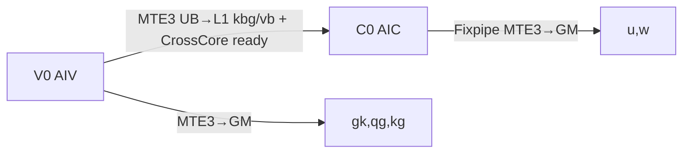
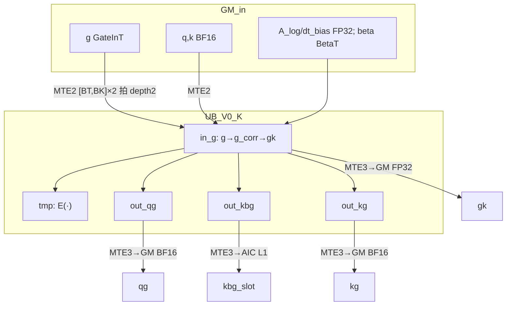
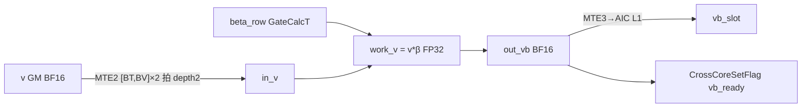
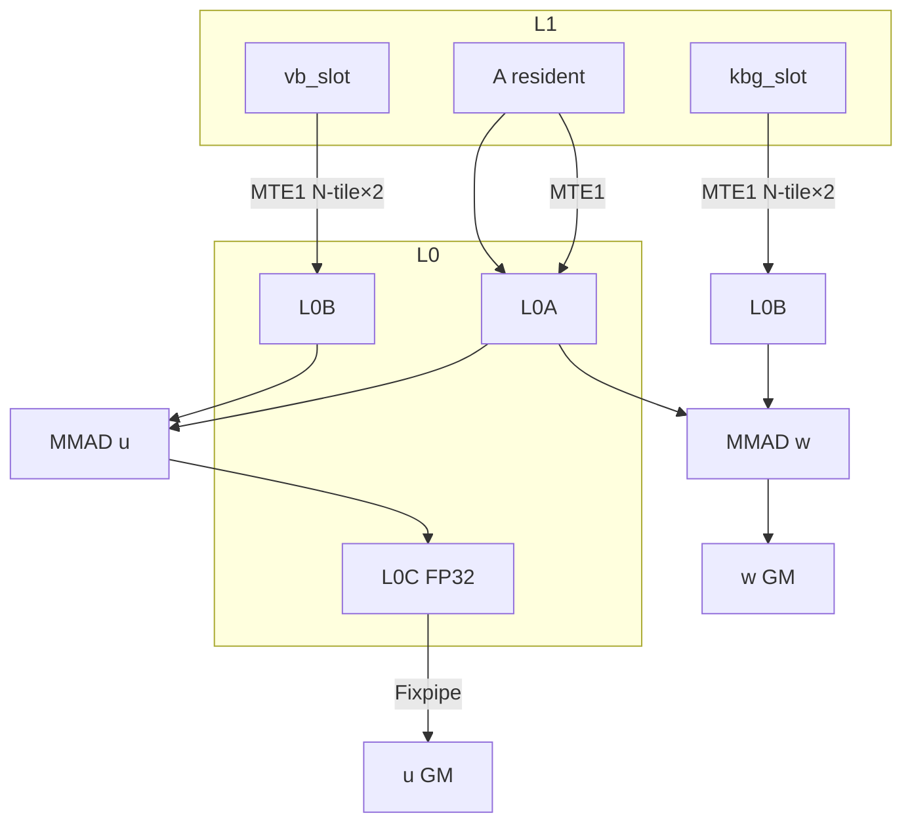

# ChunkKdaBwdRecompute A5 Ascend C 逐 Stage 算子设计

## 1. 目标

本文给出 `ChunkKdaBwdRecompute` 在 **Ascend 950（A5 / arch35 /** `__NPU_ARCH__=351x`**）** 上的 Ascend C 实现方案。

设计原则（与 FwdH 文档一致，编号对应用户约束）：

1. 每个 Stage 只含 Cube 矩阵乘 **或** Vector 运算之一。
2. Cube Stage 不读取本 Stage 的 Cube/Vector 输出；Vector Stage 允许在同一次 VF 内使用前序寄存器/UB 结果。
3. L1（512 KiB）仅 Cube；UB（248 KiB，可用约 232 KiB）仅 Vector；L1 不跑 VF，AIC 不用 UB。
4. Cube→Vector 的非公开中间量：UB 双 slot 保留（本算子无此路径）。
5. Vector→Vector 的非公开中间量：UB 双 slot 保留（`g_corr` 仅在 V0 单次 VF 内寄存器/原地覆盖，不跨 Stage）。
6. Vector→Cube 的中间量：351x 上经 **AIV UB → MTE3 → AIC L1** 直写（性能路径不进 GM）；GM fallback 见 §6.2。
7. Cube→Cube 的中间量：L1 四份物理 slot 语义（`A` 驻留 + `kbg`/`vb` 各双槽 ping-pong）。
8. 每个 Stage 峰值占用必须落在对应片上空间内。
9. L1 常驻 tensor 与跨 Stage 驻留共用地址图；为 Cube 右操作数预留 **4 份** 连续 slot（`kbg[2]` + `vb[2]`）。
10. 同一份 GM 输入在每个 Stage task 内只 MTE 一次；同数据既要 Cube 又要 Vector 时，允许 GM 分别读到 L1 与 UB（`A` 与 `g/q/k/v/β`）。
11. UB 固定地址可在 Stage 间改变语义；前一 owner 末次读取完成后才移交。
12. 单 head Stage 实例：**一次** VF（或一次逻辑 MMAD 序列）覆盖该 head 本 chunk 的全部逻辑结果；禁止把同一 Stage 拆成多次 VF / 多次 Stage pass。尾 chunk 在同一次 VF 内 mask/补零。**本条不约束 TQue 深度**：UB/L0 深度 2 用于 MTE↔VF/MMAD 流水重叠，与「是否分 Stage pass」无关。
13. 无依赖的 Cube/Vector 可物理错拍，但驻留地址不得重叠。
14. 容量无法闭合时才 GM 重复搬运（调试 workspace）。
15. 主链 `Vector → Cube`，仅 2 个逻辑 Stage；无连续 Vector/Cube 链。
16. `beta`、`gk_last` 等标量在 VF 内一次计算、驻留至末次读取，不重复 safe gate。
17. UB/L1 固定分区，禁止 compact / memmove；派生结果写独立目标区或已读完的原地。
18. 同一 dispatch 内所有 active head 走相同存储与计算路径。
19. 2 Stage 为依赖下限（V0 产出 `kbg/vb` 后才能 C0），不为减 Stage 牺牲其它规则。

351x 架构要点（[NPU 351x 规格](https://www.hiascend.com/document/detail/zh/CANNCommunityEdition/900beta2/opdevg/Ascendcopdevg/atlas_ascendc_10_00065.html)）：

- MIX 核 **1 AIC : 2 AIV**；AIV UB 经 **MTE3 硬通道** 可直写 AIC L1。
- AIC/AIV 核间同步用 **CrossCoreSetFlag / CrossCoreWaitFlag**（模式 2，1:2）。
- Vector 256 B/拍；Cube BF16 16×16 tile；L1/UB 最小 32 B 对齐。

---


## 2. 范围与 shape


### 2.1 平台与固定规格

```text
SoC              = A5 / ascend950 / arch35
kernel mode      = 1 AIC : 2 AIV MIX
chunk_size / BT  = 64
K                = 128
V                = 128
```

dtype 契约与 [INTERFACES.md](INTERFACES.md) 一致：


| 符号 / 张量             | dtype         | 说明                                                                                |
| ------------------- | ------------- | --------------------------------------------------------------------------------- |
| `QKType`            | **BF16**      | 固定；`dtype(q)=dtype(k)=BF16`；`w` / `qg` / `kg` / `kbg` 同为 BF16；**不支持 FP16 / FP32** |
| `VType`             | **BF16**      | 固定；`dtype(v)=BF16`；`u` / `vb` 同为 BF16（与 Cube `BF16×BF16` 操作数一致）                   |
| `GateInT`           | `dtype(g)`    | **BF16 或 FP32**；不支持 FP16                                                          |
| `BetaT`             | `dtype(beta)` | **BF16 或 FP32**；不支持 FP16                                                          |
| `A`                 | **BF16**      | 正向 `Akk`；Host 校验 `dtype(A)==QKType==BF16`                                         |
| `gk`（输出）            | **FP32**      | 固定                                                                                |
| `A_log` / `dt_bias` | **FP32**      | 可选输入；非空时仅 FP32                                                                    |
| `GateCalcT`         | **FP32**      | safe gate / cumsum / `E(·)` 等 gate 链路算术 dtype                                     |


Cube / Fixpipe：

```text
MMAD operand = BF16 × BF16 → FP32 accumulate
Fixpipe 量化写回：u → VType(BF16)，w → QKType(BF16)
```

V0 Vector 内：`g`/`beta` 无论 GM 为 BF16 或 FP32，参与 gate / `v*β` 的算术统一提升到 **GateCalcT（FP32）**；写回 GM 或 MTE3→L1 时再 cast 到 **BF16**（`QKType` / `VType`）。

Host 在进入 kernel 前拦截：`BT=64, K=V=128`；`q/k/v/A` **仅 BF16**；`g`/`beta` 为 BF16 或 FP32（拒绝 FP16）；`A_log`/`dt_bias` 仅 FP32；`dtype(q)==dtype(k)`；`chunk_size=64`。

### 2.2 符号

```text
B, HV, HK       batch / value head / key head；GQA 要求 HV % HK == 0
T               token 数；varlen 时物理 B=1
BT              chunk_size = 64
M               当前 chunk 有效 token 数，1 <= M <= BT
c               chunk 编号
hv              value head
hk              GQA 映射 key head，hk = floor(hv * HK / HV)
groupSize       = HV / HK
tokenBase       dense: c*BT；varlen: cu_seqlens[n] + c*BT
g_corr          safe gate 修正后的 gate；仅 V0 UB 内存在
gk              chunk 内前缀 cumsum(g_corr)，use_exp2 时再 / ln2
kbg             k * beta * E(gk)；C0 右操作数之一
vb              v * beta；C0 右操作数之一
E(x)            use_exp2 ? exp2(x) : exp(x)
gk_last         gk 最后一行 gk[M-1, :]，shape [K]
```


### 2.3 单 head 张量容量（chunk 级）

记 `sz(T) = sizeof(T)`（BF16=2 B，FP32=4 B）。容量按下表（`QKType=VType=BF16`）。


| 张量                | Shape             | dtype          | 单份大小                                   |
| ----------------- | ----------------- | -------------- | -------------------------------------- |
| `g`（GM）           | `[BT,K]`          | GateInT        | 32 KiB（GateInT=FP32；BF16 时为 16 KiB）    |
| `g_corr`/`gk`（UB） | `[BT,K]`          | GateCalcT=FP32 | 32 KiB                                 |
| `q/k`             | `[BT,K]`          | BF16           | 16 KiB                                 |
| `v`               | `[BT,V]`          | BF16           | 16 KiB                                 |
| `beta`（GM）        | `[BT]`            | BetaT          | 0.25 KiB（BetaT=FP32；BF16 时为 0.125 KiB） |
| `beta_row`（UB）    | `[BT]`            | GateCalcT=FP32 | 0.25 KiB                               |
| `A`               | `[BT,BT]`         | BF16           | 8 KiB（有效 `[M,M]`）                      |
| `gk`（GM 输出）       | `[BT,K]`          | FP32           | 32 KiB                                 |
| `qg/kg/kbg/w`     | `[BT,K]`          | BF16           | 16 KiB                                 |
| `u`               | `[BT,V]`          | BF16           | 16 KiB                                 |
| `kbg/vb`（L1）      | `[BT,K]`/`[BT,V]` | BF16           | 各 16 KiB                               |


Stage 实例原子粒度：

```text
一个 (batch_or_sequence, hv, chunk)
```

每个 AIV 一次处理 **一个 value head** 的一个 chunk；AIC 消费同 task 的 `kbg/vb`。

---


## 3. 数学语义（按 Stage）

每个 `(B, hv, c)`，有效行数 `M`：

```text
# use_gate_in_kernel=true（默认）
g_corr = lower_bound * sigmoid(exp(A_log) * (g + dt_bias))

# use_gate_in_kernel=false
g_corr = g

use_exp2=true:
    gk  = chunk_cumsum(g_corr) / ln2
    qg  = q * exp2(gk)
    kbg = k * beta * exp2(gk)
    kg  = k * exp2(gk_last - gk)

use_exp2=false:
    gk  = chunk_cumsum(g_corr)
    qg  = q * exp(gk)
    kbg = k * beta * exp(gk)
    kg  = k * exp(gk_last - gk)

vb = v * beta
u  = A @ vb      # [M,M] @ [M,V]
w  = A @ kbg     # [M,M] @ [M,K]
```

公开 GM 输出 dtype（与 INTERFACES.md 输出表一致）：


| 输出                | dtype            |
| ----------------- | ---------------- |
| `gk`              | **FP32**         |
| `w` / `qg` / `kg` | **BF16**（QKType） |
| `u`               | **BF16**（VType）  |


V0 内部中间量：`g_corr`（GateCalcT，不写出）、`kbg`（QKType）、`vb`（VType），经 MTE3 进 L1，不进 GM。

---


## 4. Stage 划分


| Stage  | 核   | 运算类型   | 数学                                        |
| ------ | --- | ------ | ----------------------------------------- |
| **V0** | AIV | Vector | safe gate → `gk` → `qg/kbg/kg`；`vb = v*β` |
| **C0** | AIC | Cube   | `u = A @ vb`；`w = A @ kbg`                |





逻辑依赖：`C0(c)` 必须在 `V0(c)` 写完 L1 `kbg/vb` 之后。  
物理调度允许 `C0(c) ∥ V0(c+1)`（L1 双槽 ping-pong），不增加逻辑 Stage。

---


## 5. Stage V0：Vector（AIV）


### 5.1 单次 VF 语义

一个 head task **只调用一次 RegBase VF**，内部顺序两段（同一函数，非两个 Stage）：

```text
Phase-K:  gate → cumsum → qg / kbg / kg   # 逻辑覆盖 [M,K]
Phase-V:  vb = v * beta                   # 逻辑覆盖 [M,V]
```

**规则 12 ≠ UB 深度。** 规则 12 禁止的是「同一 Stage 拆成多次 VF / 另开 Stage pass」；**深度 2** 是 TQue 双缓冲，用来重叠 **MTE2 ↔ VF ↔ MTE3**，与是否一次 VF 无关。

Phase-K 在 **同一次 VF** 内按 `BK=64` 做软流水（`K=128` 时内循环 2 拍）；每拍 MTE2 搬入 `[BT,BK]`，VF 算完后 MTE3 写出，TQue **深度 2** 使第 `i+1` 拍 MTE2 与第 `i` 拍 VF/MTE3 重叠。逻辑上仍覆盖完整 `[M,K]`，不另开 VF。Phase-V 同理可用 `BV=64`（`V=128` 时 2 拍）。

尾 chunk 在同一次 VF 内对 `t >= M` 行 mask 或置零。GQA：`q/k` 按 `hk` 读；`qg/kbg/kg` 按 `hv` 写 GM / L1。

### 5.2 UB 固定布局（单 AIV、单 head）

地址为 KiB 半开区间；**深度一律 2**。工作 tile 为 `[BT,BK]=[64,64]` / `[BT,BV]=[64,64]`，因此 depth=2 的 UB 峰值与「整 `[BT,K]` 且 depth=1」同量级，可进 232 KiB。

**Phase-K 活跃区（**`QKType=BF16`**；地址为单份逻辑尺寸，物理 TQue 占 2×）：**

```text
# 下列「单份」字节 × 深度 2 = 物理占用
UB in_g[2]      GateCalcT [BT,BK]   单份 16 KiB → 32 KiB   # g→g_corr→gk 原地
UB tmp[2]       GateCalcT [BT,BK]   单份 16 KiB → 32 KiB   # sigmoid / E(·)
UB in_q[2]      BF16 [BT,BK]         单份  8 KiB → 16 KiB
UB in_k[2]      BF16 [BT,BK]         单份  8 KiB → 16 KiB
UB out_qg[2]    BF16 [BT,BK]         单份  8 KiB → 16 KiB   → GM
UB out_kbg[2]   BF16 [BT,BK]         单份  8 KiB → 16 KiB   → L1 kbg
UB out_kg[2]    BF16 [BT,BK]         单份  8 KiB → 16 KiB   → GM
UB beta_row[2]  GateCalcT [BT]      单份 256 B  → 512 B    # chunk 常驻
UB dt_bias[2]   FP32 [BK]           单份 256 B  → 512 B
UB gk_last[2]   GateCalcT [BK]      单份 256 B  → 512 B
UB a_log[2]     FP32 scalar         对齐约 32 B → 64 B
```

Phase-K 峰值：**32×2 + 16×5 + ~1.6 KiB ≈ 145.6 KiB**，低于可用 232 KiB。

软流水示意（同一次 VF 内，`k0`/`k1` 为两个 BK tile）：

```text
时间 →
MTE2:  |■■ k0 ■■|■■ k1 ■■|
VF:    |        |■■ k0 ■■|■■ k1 ■■|
MTE3:  |        |        |■■ k0 ■■|■■ k1 ■■|
         \_____ depth-2 TQue：k1 的 MTE2 与 k0 的 VF 重叠 _____/
```

**Phase-V 复用（Phase-K 两拍均写完且 TQue drain 后；同 depth 2）：**

```text
UB in_v[2]      BF16 [BT,BV]         单份  8 KiB → 16 KiB
UB work_v[2]    GateCalcT [BT,BV]   单份 16 KiB → 32 KiB
UB out_vb[2]    BF16 [BT,BV]         单份  8 KiB → 16 KiB   → L1 vb
UB beta_row     沿用 Phase-K 的常驻槽
```

Phase-V 峰值：**≈ 64.5 KiB**。

Phase-K 结束后大槽 **固定地址改语义** 给 Phase-V（规则 11、17），不做 UB 内 memmove。

### 5.3 Phase-K 数据流




同一次 VF 内、每个 BK tile 的顺序（寄存器前向依赖，符合规则 2；拍间靠 depth-2 TQue 重叠）：

1. MTE2 `g` 的当前 `[BT,BK]`（GateInT）→ VF 升 **GateCalcT** → `in_g`；加 `dt_bias`；safe gate → `g_corr` **覆盖** `in_g`
2. 沿 BT 前缀和（跨 BK tile 时 cumsum 状态在标量/寄存器中延续）；`use_exp2` 时 × `1/ln2` → `gk` **覆盖** `in_g`；末 tile 末行 → `gk_last`；MTE3 `gk→GM（FP32）`
3. `beta` 在 chunk 开始时 MTE2 一次进 `beta_row`；`tmp ← E(gk)`；`out_qg / out_kbg ← cast_BF16(...)`
4. `tmp ← E(gk_last - gk)`；`out_kg ← cast_BF16(k * tmp)`
5. MTE3：`qg/kg→GM`，`kbg→L1`；全部 BK/BV 拍与 Phase-V 完成后 `CrossCoreSetFlag` **chunk_ready**


### 5.4 Phase-V 数据流




`kbg_ready` 与 `vb_ready` 可合并为同一 flagId（两者都写完再 signal），或分两个 flag 由 C0 各 wait一次；推荐 **单 flag** `chunk_ready`，V0 在两路 MTE3 均完成后 set 一次。

V0 写 L1 下一槽前 `CrossCoreWaitFlag chunk_free`（C0 上一 chunk 已释放该槽）。

---


## 6. Stage C0：Cube（AIC）

AIC **不使用 UB**。`A` 从 GM 读入；`kbg/vb` 仅来自 L1（V0 MTE3 写入），C0 不重复从 GM 读 `k/v/β`。

### 6.1 L1 固定布局

```text
L1[0,8)       A_resident    BF16 [BT,BT] NZ   # 本 chunk 一次 MTE2，u/w 共用
L1[8,40)      kbg_slot[0]   BF16 [BT,K]
L1[40,72)     kbg_slot[1]   BF16 [BT,K]
L1[72,104)    vb_slot[0]    BF16 [BT,V]
L1[104,136)   vb_slot[1]    BF16 [BT,V]
L1[136,512)   空闲
```

合计 **136 KiB** ≪ 512 KiB。  
四份 Cube 右操作数 slot（`kbg[2]+vb[2]`）满足规则 9；`A` 驻留不占 ping-pong 槽位。

```text
slot = chunk_id % 2
kbg_slot[slot] , vb_slot[slot]   # V0 写、C0 读
```


### 6.2 L0 与 MMAD


| 缓冲  | 内容                           | 大小              |
| --- | ---------------------------- | --------------- |
| L0A | `A` tile `[64,64]` BF16      | 16 KiB × depth2 |
| L0B | `kbg`/`vb` 列块 `[64,64]` BF16 | 16 KiB × depth2 |
| L0C | 累加 `[64,64]` FP32            | 32 KiB × depth2 |


一次 C0 task 内顺序：

```text
1. CrossCoreWaitFlag chunk_ready
2. MTE2: A GM → L1 A_resident（若与同 chunk 其它 head 共享 A，可按 task 缓存；每 task 至少读一次）
3. GEMM-u:  A @ vb  →  Fixpipe → GM u（BF16）
4. GEMM-w:  A @ kbg →  Fixpipe → GM w（BF16）
5. CrossCoreSetFlag chunk_free
```

`K=V=128` 时 N 维两拍（每拍 64 列），仍在 **同一 C0 Stage 实例** 内完成；两趟 GEMM **均只读 L1 中 V0 已写入的** `vb/kbg` **与** `A`，不读本 Stage 刚写的 `u/w`（规则 2）。




### 6.3 GM fallback（调试 / 规则 14）

与 golden 对齐时可物化整段 workspace：

```text
kbg : [B, HV, T, K]  BF16
vb  : [B, HV, T, V]  BF16
```

V0 `MTE3→GM`，C0 `MTE2 GM→L1`。性能路径 **user workspace = 0**，走 §5–§6.1 的 UB→L1 MTE3。

---


## 7. 跨核同步与物理调度


### 7.1 Flag 协议（AIC:AIV = 1:2，模式 2）


| flagId        | 生产者    | 消费者    | 含义                     |
| ------------- | ------ | ------ | ---------------------- |
| `chunk_ready` | AIV V0 | AIC C0 | L1 slot 内 `kbg+vb` 写完成 |
| `chunk_free`  | AIC C0 | AIV V0 | L1 slot 已消费，可写下一 chunk |


```text
V0(c):  算 kbg/vb → MTE3→L1[slot=c%2] → Set chunk_ready
C0(c):  Wait chunk_ready → MMAD u,w → Set chunk_free
V0(c+1): Wait chunk_free（若写 slot=c%2）→ ...
```

tail / 空 chunk：AIV 仍走 set/wait，避免 AIC 空等。

### 7.2 时间轴（3 chunk 示例）

Mermaid `gantt` 按 section 分行，**看不出 AIV 与 AIC 在同一时刻并行**。下面用 **共用时间轴** 表示（每格相同宽度；`█`=占用，`·`=空闲）：

```text
时间 →     |---- t0 ----|---- t1 ----|---- t2 ----|---- t3 ----|
           0            3            6            9           12

AIV (V0)   |██ V0(c0) ██|██ V0(c1) ██|██ V0(c2) ██|            |
AIC (C0)   |            |██ C0(c0) ██|██ C0(c1) ██|██ C0(c2) ██|

L1 slot0   | V0写 c0   | C0读 c0   | V0写 c2   |            |
L1 slot1   |            | V0写 c1   | C0读 c1   |            |
           ^            ^^^^^^^^^^^^  ^^^^^^^^^^^^
           仅 V0        C0(c0)∥V0(c1) C0(c1)∥V0(c2)
```

错拍含义：`C0(c)` **与** `V0(c+1)` **在同一时间段并行**，因为 ping-pong 使用不同 L1 槽（`c%2` 与 `(c+1)%2` 不同），互不踩 slot：


| 并行窗口       | 同时进行             | L1 槽                                                  |
| ---------- | ---------------- | ----------------------------------------------------- |
| t1 `[3,6)` | `C0(c0)` 读 slot0 | slot0 被 C0 读；slot1 由 `V0(c1)` 写                       |
| t2 `[6,9)` | `C0(c1)` 读 slot1 | slot1 被 C0 读；slot0 由 `V0(c2)` 写（需等 `C0(c0)` 释放 slot0） |


首尾各有一段 **无法重叠** 的串行：`t0` 只有 `V0(c0)`（尚无 `kbg/vb` 供 C0）；`t3` 只有 `C0(c2)`（最后一个 chunk 的 V0 已结束）。chunk 数 ≥2 时，中间各拍才有 `C0(c) ∥ V0(c+1)`。

核内：`MTE2/MTE3/V/Fixpipe` 之间按 351x 文档用 `SetFlag/WaitFlag`（HardEvent）成对同步；EventID 动态分配并及时释放。

---


## 8. GM 读写汇总（单 head task）


| 数据               | 方向         | Stage | 次数                                    |
| ---------------- | ---------- | ----- | ------------------------------------- |
| `g`              | GM→UB      | V0    | 按 BK 拍各 1（逻辑覆盖满 `[BT,K]`，不跨 Stage 重读） |
| `q,k`            | GM→UB      | V0    | 同上                                    |
| `v`              | GM→UB      | V0    | 按 BV 拍各 1                             |
| `beta`           | GM→UB      | V0    | 1（chunk 常驻）                           |
| `A_log, dt_bias` | GM→UB      | V0    | 各 1                                   |
| `A`              | GM→L1      | C0    | 1                                     |
| `gk,qg,kg,u,w`   | UB/L0→GM   | V0/C0 | 各写满逻辑 Tensor 一次                       |
| `kbg,vb`         | UB→L1 MTE3 | V0    | 各写满一次（性能路径）                           |


`A` 仅 C0 从 GM 读；`g/q/k/v/β` 仅 V0 从 GM 读。规则 10 的「不重复」指 **同一逻辑元素不跨 Stage / 不二次完整重读**；同一次 VF 内按 `BK/BV` 分拍 MTE 属于 depth-2 软流水，不算违规。  
`kbg/vb` 不经 GM（规则 6 的 351x 实现：直写 L1）。

---


## 9. 峰值与余量


| 位置             | 硬件               | 峰值（depth 2，`BK=BV=64`） | 余量      |
| -------------- | ---------------- | ---------------------- | ------- |
| UB（V0 Phase-K） | 248 KiB（~232 可用） | **≈ 145.6 KiB**        | ~86 KiB |
| UB（V0 Phase-V） | 同上               | ≈ 64.5 KiB             | 更松      |
| L1             | 512 KiB          | 136 KiB（BF16）          | 充足      |
| L0A/L0B        | 64 KiB           | 16 KiB × depth2        | 充足      |
| L0C            | 256 KiB          | 32 KiB × depth2        | 充足      |


`QKType`/`VType` 固定 **BF16**；无 `q/k/v/A` 的 FP16/FP32 模板。

---


## 10. 实现准入条件

1. Host 拦截：`q/k/v/A` **仅 BF16**（拒绝 FP16/FP32）；`g`/`beta` 为 BF16 或 FP32（拒绝 FP16）；`A_log`/`dt_bias` 仅 FP32；`dtype(q)==dtype(k)`；`use_gate_in_kernel` 由 `gkOutOptional==nullptr` 推导（见 INTERFACES.md）。
2. Tiling：`task = (batch/seq, hv, chunk)`；V0 内 `BK=BV=64`；L1 `slot = chunk_id % 2`；按 `GateInT`/`BetaT` 选择 VF 分支。
3. V0：**单次** RegBase VF；TQue **深度 2**；Phase-K 再 Phase-V；gate 算术 GateCalcT=FP32；公开 `gk` 写 FP32，`qg/kg/w` 写 BF16；`kbg/vb` MTE3→L1（BF16）。
4. C0：无 UB；MMAD `BF16×BF16→FP32`；Fixpipe 写回 `u`/`w`（BF16）；`chunk_ready/chunk_free` 与 Matmul 高阶 API 的 flagId 错开。
5. 测试：golden 对齐（`q/k/v` 用 BF16）；`GateInT`/`BetaT` BF16 与 FP32；GQA；`use_exp2`；`use_gate_in_kernel`；尾 chunk；varlen；depth-2 与错拍。

