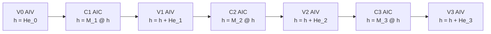
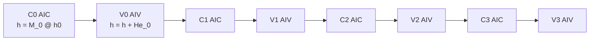
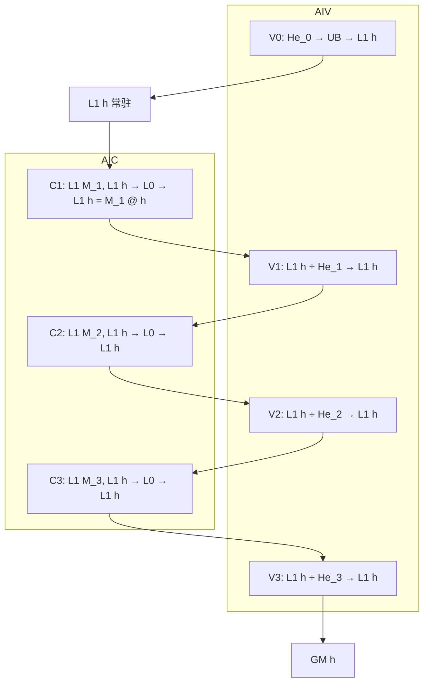

# `merge_fwd_bwd` 设计

本文是 CP / 卡内切分里把各 rank 仿射状态合成一份 `h` 的实现前设计。公式与 FLA `merge_fwd_bwd_kernel` 相同，stage 按昇腾 AIC/AIV 约束拆开。公开 CP 接口不在本文范围；落地私有 L0 前需 `@weinachuan` 确认。

L0 def / L2 aclnn / Torch 草案见 [INTERFACES.md](INTERFACES.md)。

目标平台按 `common/include/kernel/hardware.h`：UB 192 KiB，L1 512 KiB，L0A/L0B 64 KiB，L0C 128 KiB。UB 预留 16 KiB，可用约 176 KiB。

默认优势域：`K = V = 128`，`H_v` 任意，计算 FP32，`He/M` 可为 BF16。

## 1. 数学

每个 rank 一块 `[He | M]`：

- `He`：`[K, V]`，加性
- `M`：`[K, K]`，线性映射

合成：

```text
h ← M @ h          # cube，128×128 @ 128×V，必须 AIC
h ← h + He         # vector，单独 AIV
```

FWD 沿过去 rank 左乘，得到本 rank 第一条的 `initial_state`。  
BWD 沿未来 rank 倒序，得到本 rank 最后一条的 `dht`。公式相同，只改遍历方向。

`state_v_first=true` 时 `h` 为 `[V, K]`：

```text
h ← h @ M^T
h ← h + He^T
```

`ag_hm` 仍是 `[K, V+K]`：`[..., :V] = He`，`[..., V:] = M`。

## 2. Stage 划分

`K=128` 的 `M @ h` 超过 64×64，只能 cube。下一拍 cube 要吃这一拍写完的 `h`，所以 **相邻 `M @ h` 不能放进同一个 AIC stage**。`+ He` 也不再融进 MMAD bias：那会让「本 stage cube 输出」被同一拍的向量依赖说不清；按约束拆成 C 然后 V。

**无 `h0`（CP 默认，起点 `h = 0`）**

| Stage | 核 | 公式 |
| --- | --- | --- |
| **V0** | AIV | `h = He_0`（`M_0 @ 0` 省掉） |
| **C_r** | AIC | `h = M_r @ h` |
| **V_r** | AIV | `h = h + He_r` |

`r = 1 .. R-1`。默认 `R=4`：V0, C1, V1, C2, V2, C3, V3。



**有 `h0`（卡内）**

| Stage | 核 | 公式 |
| --- | --- | --- |
| **C_r** | AIC | `h = M_r @ h` |
| **V_r** | AIV | `h = h + He_r` |

`r = 0 .. R-1`，第一对是 C0、V0。



V 维 32/64 tile 互不依赖，同一 `C_r` / `V_r` 里并行，不另开 stage。Stage 数跟 `R` 走，不是固定 2。

## 3. 任务划分

一个核绑定一个 `H_v`，在核内把该 head 的 rank 链跑完。Head 之间无依赖，不需要 cross-head workspace 队列。

```text
grid: (ceil(V / BV), H_v)
核内: for r in order:  C_r then V_r
```

`BV ∈ {32, 64}`。`K` 在 cube 侧再切成 64，避免单次 MMAD 超过 64×64。

同一核上 C_r → V_r 的 `h` 优先留 L1，避免每拍都打回 GM。下一拍 C_{r+1} 仍在该核，继续读 L1 里的 `h`。

## 4. 无 h0：V0 UB

拷贝 `He_0 → h`。一次处理 `[K, BV] = [128, 64]`。

| Slot | 形状 | dtype | 深度 | 字节 | 用途 |
| --- | --- | --- | ---: | ---: | --- |
| `in_he` | `[K,BV]` | BF16 | 2 | 32 KiB | MTE2 |
| `work` | `[K,BV]` | FP32 | 1 | 32 KiB | 转 FP32 / 可选转置 |
| `out_h` | `[K,BV]` | FP32 | 2 | 64 KiB | 写 L1 中的 `h` 或 GM |

峰值 **128 KiB**。`BV=32` 时可减半。`state_v_first` 时在 `work` 里对 `[K,BV]` 做转置再写 `[BV,K]`。

V0 不做矩阵乘，不占 L0。

## 5. C_r：L1 / L0（无 UB）

`M` 为 128×128，必须 cube，按 64×64 切。一次产出 `h` 的一个 `BV` 条带：`[K, BV] = [128, 64]`。

`M @ h` 拆成 K 维 2×2 个 64×64 MMAD：

```text
h[0:64,  v] += M[0:64, 0:64] @ h[0:64, v]
h[0:64,  v] += M[0:64, 64:128] @ h[64:128, v]
h[64:128,v] += M[64:128,0:64] @ h[0:64, v]
h[64:128,v] += M[64:128,64:128] @ h[64:128, v]
```

| 缓冲 | 内容 | dtype | 字节 |
| --- | --- | --- | ---: |
| L1 `M` | `[128,128]` NZ | BF16 | 32 KiB |
| L1 `h` | 本 head 全量 `[128,128]` | FP32 | 64 KiB |
| L1 `B` ping | 当前 `h` 的 `[64,64]` 从 L1 进 L0B 的影子 | FP32 | 2×16 KiB |
| L0A | `M` 的 64×64 | BF16 | 8 KiB |
| L0B | `h` 的 64×64 | FP32 | 16 KiB |
| L0C | 部分和 `[64,64]` | FP32 | 16 KiB |

L1 峰值约 **32 + 64 + 32 = 128 KiB**，远小于 512 KiB。`h` 常驻 L1，C_r 写回同一块 L1 `h`（对应 BV 条带）。**不要**把 `He` 当 L0C bias 融进来。

`state_v_first`：L0 做 `h @ M^T`，`h` 条带改为 `[BV, K]`，L1 布局跟着转，容量不变。

## 6. V_r UB

`h ← h + He_r`。从 L1/`h` 搬一条带到 UB，与 `He` 相加，写回 L1。

| Slot | 形状 | dtype | 深度 | 字节 |
| --- | --- | --- | ---: | ---: |
| `in_h` | `[K,BV]` | FP32 | 2 | 64 KiB |
| `in_he` | `[K,BV]` | BF16 | 2 | 32 KiB |
| `work` | `[K,BV]` | FP32 | 1 | 32 KiB |
| `out_h` | `[K,BV]` | FP32 | 1 | 32 KiB |

若 `in_h` 与 `out_h` 原地：去掉 `out_h`，峰值 **128 KiB**（`64+32+32`）。`BV=32` 更松。

`He` 转 FP32 后加到 `h`。加完的 `h` 写回 L1，供下一拍 C_{r+1}。最后一拍 V_{R-1} 再 MTE3 到公开 GM。

## 7. GM workspace

这条链只有一份在跑的状态 `h`，不需要 `kbg/vb` 那种跨 stage 大块。

| 缓冲 | 形状 | dtype | 谁写谁读 | 是否必须 |
| --- | --- | --- | --- | --- |
| 公开 `h` | `[H_v,K,V]` 或 `[H_v,V,K]` | 与调用约定 | 最后一拍 V 写 | 是 |
| `h_l1` | 核内 `[K,V]` | FP32 | C_r / V_r 交替 | L1，不算 GM |
| `h_ws` | `[H_v,K,V]` FP32 | FP32 | 若公开 dtype 不是 FP32，全程用这份，最后再 round | 可选 |
| `ag_hm` | `[R,H_v,K,V+K]` | 输入 dtype | 只读 | 输入，不是 workspace |

推荐：计算全程 FP32 的 `h` 放 L1 + 可选 `h_ws`。默认 case 一份 `h_ws`：

```text
H_v * K * V * 4 = 4 * 128 * 128 * 4 = 256 KiB
```

无 h0 时 V0 直接把 `He_0` 写成这份 FP32 `h`（或先写 L1，最后再写 GM）。

不需要 rank 维的 slot 队列：rank 链在同一核上串行，C_r 与 V_r 用 L1 `h` 交接。Head 并行时每核一份 L1 `h`，互不占用对方 GM workspace。

若实现成「每个 C_r / V_r 独立 launch」（golden 的 staged Triton 就是这样），则每拍都要把 `h` 写回 GM `h_ws`，下一拍再读。融合单 L0 时应取消这些中间 GM 往返，只在最后一拍写出。

## 8. 核内流水（单 head、R=4、无 h0）



时间轴：

```mermaid
gantt
  title 无 h0 · R=4 · 同一核先后两拍
  dateFormat X
  axisFormat %s
  section AIV
  V0 He0          :0, 2
  V1 plus He1     :4, 2
  V2 plus He2     :8, 2
  V3 plus He3     :12, 2
  section AIC
  C1 M1@h         :2, 2
  C2 M2@h         :6, 2
  C3 M3@h         :10, 2
  section L1
  h resident      :0, 14
```



有 `h0` 时去掉 V0 拷贝，C0 从 `h0`（先搬进 L1）开始。

AIC 与 AIV 仍不能在同一逻辑 stage 混用。同一核上 C_r 与 V_r 是先后两拍；`h` 已在 L1，不经过「本 stage 的 cube 输出被同 stage 向量吃」——向量拍开始时 cube 拍已经结束。

## 9. 与 FLA kernel 的差异

官方 `merge_fwd_bwd_kernel` 在一个 Triton launch 里对所有 rank 做 `h = M @ h + He`（无 h0 时第一拍数学上等于 `He_0`）。本设计：

- 第一拍无乘，走 V0 拷贝
- 之后每拍拆成 C_r + V_r
- 最终 `h` 与 FLA 同构；中间 `h_c*` / `h_v*` 只在 golden 里落盘

CP 模式 FLA 不接 `h0`。卡内 `h0` 只有本 staged 路径覆盖。
